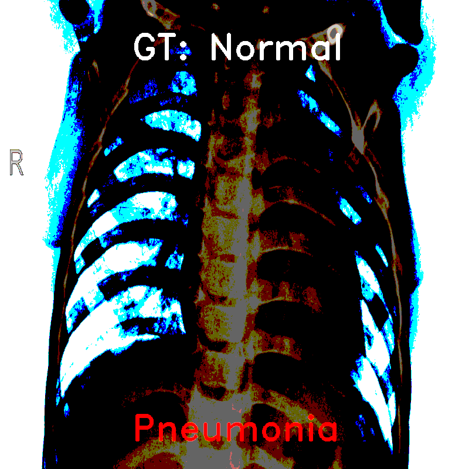
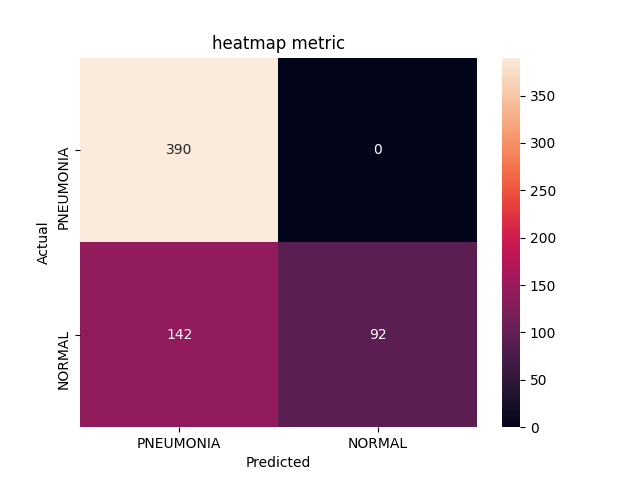

# Pneumonia Classifier

used data : https://www.kaggle.com/paultimothymooney/chest-xray-pneumonia

***

test samples:

---

## Quick Start

1. dependencies: matplotlib, torch, torchvision, sklearn, seaborn, numpy, imgaug, PIL, cv2
2. download the code and create a project.
3. download data to "./data/train" , "./data/val" , "./data/test"
4. label your data like "./data/train/class1", "./data/train/class2..."....
5. run 'train.py'
6. you can edit the parameters in 'parameters.py'

---

## User Setting Variables

#### train.py

1. mode
   * 'new': create an archive on a new branch.
   * 'overlay': training continues in the target existing branch.
   * 'load': training continues on a new branch.
2. netend
   - Variable defining terminal linear classifier for transfer-learning (you can disable)
   - See networks/nets.py
3. network
   - Variable defining pre-trained Network
4. loss_f, optimizer
5. load_branch, load_num: if you use 'overlay' or 'load' mode.
6. transform_set

---

#### parameters.py

1. model_name
2. params: parameters used in training and validation
3. test_params: parameters used in test
4. user_setting, permission

---

#### test.py

1. branch_num, epoch_num: same in load_branch and load_num in 'train.py'
2. netend, model: same in netend and network in 'train.py'

---

#### ensemble.py

code for model ensemble. you have to pay attention to the order and fill the lists: <'model_list', branch_nums, epoch_nums, models>

1. model_list: names of the model in the weight files
2. branch_nums: branch address of target weight file
3. epoch_num: epoch number of target weight file
4. models: model definition list
5. transform_set

---